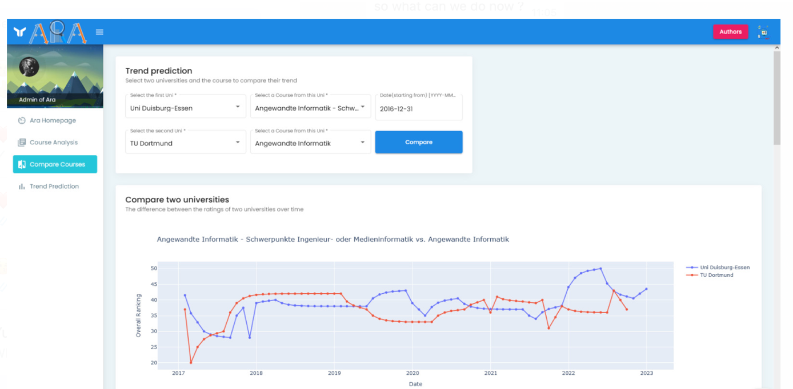

# LATFinders: ARA Project


## Project Idea:

To support student’s decision to choose a course based on other student's reviews, so they can: 

* Get overall and detailed view about courses.
* Compare courses from different universities and make it easier to choose a course.
* Predict the future trend of course overall ratings based on previous students’ ratings.


### Youtube video shows our project:  [ARA Demo](https://youtu.be/zNUWVJ-DFaw)
***

## Project Architecture:


***

## Tools, Algorithms and Libraries used:

* **Database:**
   * Beautifulsoup to scrape Studycheck website
   * Render as Cloud application hosting
   * Postgres as Database

* **Frontend Development:**
   * Angular
   * Library Plotly for Data Visualization

* **Backend Development:**
   * Flask: REST API
   * Machine Learning Algorithm: SARIMA Model
   * Plotly Library for creating Data Visualization

* **Version Control System:**
   * Git

* **Code Hosting Server:** 
   * Github

***

## Visualization: (Screenshot)
  * Home Page:

  * Course Analysis:

  * Compare Courses:

  * Trend Prediction:


***

## Installation

Install Python, NodeJS and Angular
Use the pip package manager [pip](https://pip.pypa.io/en/stable/) to install all the required dependencies.

+ sqlalchemy
+ flask_sqlalchemy
+ flask
+ python-dotenv 
+ Flask-Cors
To install dependencies:
```bash
pip install -U flask-cors
```
Go to the folder of frontend and do
```bash
npm install
```
Set Database URI as Environment variable
E.g in windows:
```bash
export SQLALCHEMY_DATABASE_URI_DEV="databaseURI..." 
```

Make sure that the port of backend in app.py is the same as the port that is configured in frontend. You can set it in frontend in the file: *./frontend/src/environments/environment.prod.ts*

Run Backend: 
```bash
cd src
python app.py
```
Run Frontend:
```bash
cd frontend
npm install
ng serve
```

***

## LATFinders members:
   * Mahdyar Safarianbarmi
   * William Kana Tsoplefack
   * Nikolas Gur
   * Yusra Abdulrahman
   * Ghazal Abbasi

***
